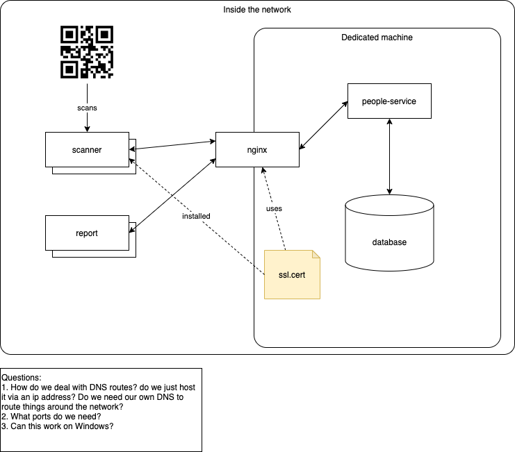

# Check-in
The Check in System is a system that enables a person to keep track of the total amount of people that have entered 
into a session or some group activity of some sort.

## Links

Here is the demo scanner page: https://squireofsoftware.github.io/check-in/

Here is the people-service middleware image: https://hub.docker.com/repository/docker/rhinoflower/check-in/general
- this is just a spring boot application wrapped up in a docker image

Here is the demo scanner image: https://hub.docker.com/repository/docker/rhinoflower/checkin-scanner
- this includes nginx with rerouting for the spring boot application

## Docker notes

- On MacOS, you MUST bind your volumes under `/Users/<Username>/...` otherwise docker will not find your host
  directory to bind your volumes to from:
  https://stackoverflow.com/questions/36451739/run-postgres-container-with-data-volumes-through-docker-machine
- On Windows, you MUST run DockerDesktop as Administrator and then run the command prompt as Administrator,
  this is to enable docker to pull images down and do all the necessary things that docker needs to do like,
  volume binding etc. without any issues.

## Design styling

- Mouseover names - grey the blurbs, takes precendence over any highlighting
- If it is you that is in the search box, then highlight everything as a green
- If there is a conflict, highlight conflicts in red (no more than one person in a service, assume that data from the database is good)

## The use case

More specifically the use case that this system arises from is basically one of a role call system in which it keeps 
track of who is currently present and who isn't present during a church service.

The existing system is one of a printed excel word document (not even a spreadsheet) and it currently is often out 
dated and quite cumbersome to keep manually count how many people are currently present and match that against who 
have checked their names off.

## Some necessary descriptions

People come in and they "sign" themselves in with a person on the desk keeping count of everyone.

The person at the desk needs to make sure that the number of people in the room matches the number of people 
ticked off on the role. 

The count serves two purposes: 

1. To see if a person is away (and whether or not they need to followed up on, like maybe they are sick or 
   something and need visiting)
2. To help the cooking team out with the number of people (since lunch is free, it would help to have an 
   approximate number of people to cook for)

During the service, a person usually comes and collects that number. However that does not mean to say that people
do not come in late. There are instances when people turn up 10 to 30 minutes late.

A person may also come with a group of others, so like Darryn Smith might carpool with Jodie Foster's 
family, even though they are unrelated, they would arrive at the same time. Similarly, say Jodie's family is away, 
Darryn might not be able to go to church as a result.

Groups can be groups of friends or family, it does not have to be bound by blood, it can be by area or by 
convenience or even relationship.

A person can also be considered a "member" (an "active" participant in a church) and can be "baptised". 
Please note that a person can be baptised but not a member (see the constitution with regards to voting ages, 
so you can be baptised at 16 but not able to do anything until you are 18, very strange rule, but it is a rule 
nonetheless). 

But the inverse is not true, you cannot be a member and not baptised, you must be baptised to be considered a member.

A "member" can be considered inactive if they fail to attend a church service within a year. For example if 
Darryn chooses not to go to church for 52 weeks, then he will be deemed "inactive" and will not be able to 
"hold" any authority or rights until he returns.

However to "reactivate" someone, it must be sorted out with the leaders and then have that person "reactivated".

(Note: as I type this out, I realise how rediculous this actually is, but nonetheless it is an important requirement 
to model in a system such as this)

Membership dates can be recorded to justify whether that person is indeed a member, as well as baptism dates.

A person can be male or female or unknown (for the purposes of this data collection storage).

A person can have an age. Though it is not compulsory to have one, it is a "nice to have" though it is not 
compulsory to have one, only if the person is willing to give it out.

A person can have a first, last, middle, nick, chinese, malaysian name. If it is a name other than english 
then the pronounciation would be preferred to be kept with the name to assist with verbalising the person's name.

A person can have multiple mobile numbers and multiple email addresses. Though it is not compulsory to have one, 
it is a "nice to have" though it is not compulsory to have one, only if the person is willing to give it out.

For the purposes of this task, we will consider Addresses out of scope.

A "sign in" is a time associated with a person. That is, a typical sign in is formed from a datetime in which 
a person has arrived and is present during a "church service". Note that arriving after a church service has 
ended does not count. The "sign in" is only valid during a service.

A "sign in" is also a "once off", you cannot "sign back in" once you have been signed in. Nor do we record when 
you "sign out" for the purposes of this system we only record "sign ins".

A service has a start and end time, typically 9:45am to approximately 11am.

A service only ever runs on a Sunday, though there may be some slight changes for special occasions like holidays 
or special "Christian" events like Christmas or Chinese New Year.

A welcoming person is typically someone who is familiar with the people who come into the service. So they might see 
that Darryn has arrived and would tick his name. Ideally the welcoming person will find the person in accordance 
with the names provided and "sign that person in".

A welcoming person may also on occasion add a new person. Though note that we have had duplicates in the past so 
it is recommended to double check everything before adding a new person to a roster (it is recommended to at least 
get the first and last name to help with identification).

The list of names may also contain "inactive" people (people who no longer are willing to come to the church), in 
which case, it is recommended to remove them from the immediate list. However should they appear, then there needs 
to be a mechanism to revive old members out. So the immediate list would not show inactive members, but if a search 
is done given their names as the key identifiers then their name may appear in the search and they can "sign in" 
under that name.

Please also note that a person can change their name or get married as well.

## Architecture

The general structure of this system will be the following:

Database

   V

Application server
This server is to act as the gatekeeper of the "source of truth" 
(all information current available about the service and people)

   V

Clients (this can be mobile devices or PCs)
- These devices have QR codes to sign in people or to read QR codes

The idea is that we expose "endpoints" in the Application server and Clients visit the end points via HTTP and 
get the necessary information out.

For the purposes of this project, security is not super tight. Input validation and hashing will be enough.

The clients will be front end code, that synchronise themselves with the backend, whether thats pushing updates 
from the backend or pulling updates every 5 seconds. In any case, the backend will act as a barrier for bad sign ins.

The MVP is: 
- a simple sign in website
- "signs" a person in under a given account
- can create a person
- poll for current sign ins

Performance metrics are:
- Load the base framework of the website within 3 seconds, asynchronously load (and show the loading) the necessary data
- Do not load the entire database into the client, only load what they need to see

There are some constraints for example:
- Chrome disabled the accessibility of cameras if you are serving http content over the http protocol. 
  This was adjusted in 2017 and will fail to load the user media devices if you do not serve the content 
  over https, this means that for this process to work, we need an internal self signed SSL certificate
  so that users can use their camera to read things.